# **Analyse des données produits Uniqlo**

## **Introduction**

Dans le cadre du module **_E4_DSIA_4201C - Data Engineering_**, nous avons eu l’opportunité de mettre en pratique les concepts étudiés en cours en réalisant un projet intégral en binôme. Ce projet consistait à scraper des données depuis un site web, les stocker dans une base de données, et concevoir une application web interactive capable d’afficher ces informations de manière optimale.

Encadré par **Monsieur Jeremy SURGET** et son équipe, ce projet a été développé par le binôme composé de **Ahmed DIAKITE** et **Bio Anicet Cyrille KOUMA**. Nous avons choisi de travailler sur les données disponibles sur le site de **Uniqlo**, un acteur majeur de la mode et de l’habillement. **Le scraping en temps réel** a permis de recueillir des informations détaillées sur plusieurs catégories de vêtements, notamment les **doudounes**, **pantalons** et **vestes**, comprenant des attributs comme le prix, la référence, la note attribuée par les utilisateurs, et les catégories homme/femme.

## **Problématique**

Nous avons orienté notre réflexion autour de la question suivante :  
**Comment évaluer l’impact du sexe sur la perception et la tarification des vêtements chez Uniqlo ?**

Cette problématique nous permet d’explorer plusieurs axes d’analyse, tels que :  
- Existe-t-il des différences significatives entre les notes attribuées aux vêtements pour hommes et pour femmes ?  
- Les vêtements pour femmes sont-ils en moyenne plus chers ou moins chers que ceux pour hommes dans les mêmes catégories ?  
- Quels sont les facteurs pouvant influencer la note d’un vêtement (prix, catégorie, etc.) ?  

## **Objectif**

Ce projet vise à fournir des insights à la fois visuels et analytiques à travers un tableau de bord interactif conçu avec **Dash**. Nous espérons que ces analyses pourront offrir une perspective enrichissante sur la manière dont les produits vestimentaires sont perçus et valorisés en fonction de leur public cible.

---
## **Sommaire**

I. [Guide utilisateur](#guide-utilisateur)  
&nbsp;&nbsp;&nbsp;&nbsp;a. [Installation et fonctionnement](#installation-et-fonctionnement)  
&nbsp;&nbsp;&nbsp;&nbsp;b. [Choix techniques et dashboard](#choix-techniques-et-dashboard)  

II. [Guide développeur](#guide-développeur)  
&nbsp;&nbsp;&nbsp;&nbsp;1. [Répertoires & fichiers](#répertoires--fichiers)  

III. [Prise en main de la dataset, Indicateurs et Analyses](#prise-en-main-de-la-dataset-indicateurs-et-analyses)  
&nbsp;&nbsp;&nbsp;&nbsp;1. [Requêtes dataset et distribution des échantillons](#requêtes-dataset-et-distribution-des-échantillons)  
&nbsp;&nbsp;&nbsp;&nbsp;2. [Statistiques](#statistiques)  

V. [Conclusion](#conclusion)  

---

## **Guide utilisateur**

### **Installation et fonctionnement**
Pour lancer le projet, suivez ces étapes :

1. **Clonez le dépôt Git :**
   ```bash
   git clone https:......
2. **Lancez et construisez les containers Docker avec la commande :**

   ```bash
   docker-compose up --build
3. **Accédez au dashboard via :**
    ```bash
    http://localhost:8050/
     
### **Choix techniques et dashboard**

-  **Docker** : Utilisé pour containeriser l'application, ce qui facilite le déploiement et assure la cohérence entre les environnements de développement et de production.

- 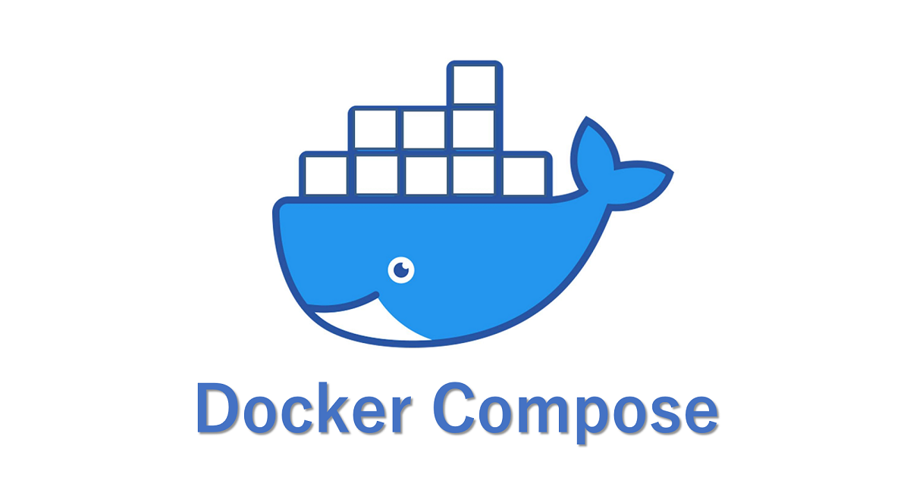 **Docker-compose** : Employé pour orchestrer les services multiconteneurs (Scrapy, Dash, MongoDB).

- **Scrapy** : Outil de crawling pour l'extraction des données. Sa puissance et sa facilité d'utilisation en font un choix optimal. Selenium n'a pas été utilisé en raison de son incompatibilité avec Docker.

-  **MongoDB** : Base de données choisie pour sa flexibilité avec les données semi-structurées et sa capacité à gérer de grands volumes.

-  **Dash** : Technologie utilisée pour représenter les données sous forme de tableau de bord interactif et accessible.

-  **Elasticsearch**: technologie utilisé pour faire des recherches dans la base de donnée.


## **Guide développeur**

### **Répertoires & fichiers**

Voici l'organisation des fichiers et répertoires du projet :

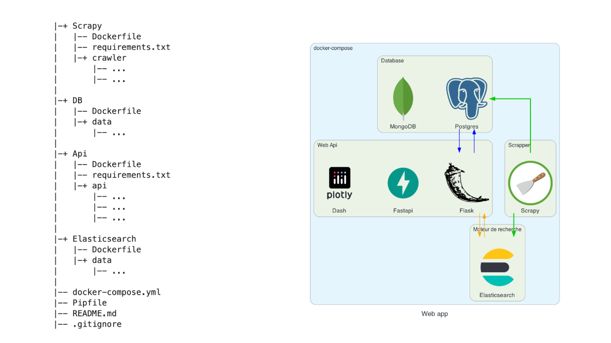

#### **Description des répertoires :**
- **Scrapy** : Contient les scripts pour le scraping des données. Ces scripts sont configurés pour collecter dynamiquement les informations des produits depuis le site web.
- **DB** : Structure dédiée à la gestion des bases de données, comprenant les fichiers nécessaires pour MongoDB.
- **Api** : Implémente une API pour interagir avec les données via des requêtes HTTP.
- **Elasticsearch** : Configuration et utilisation du moteur de recherche pour des recherches avancées dans les données.
- **docker-compose.yml** : Fichier central pour orchestrer tous les services via Docker.

#### **Principaux points à noter :**
- Le scraping des données est réalisé en temps réel grâce à Scrapy.
- Les données collectées sont organisées et stockées dans MongoDB pour une exploitation flexible.
- ElasticSearch est utilisé pour offrir un moteur de recherche performant, particulièrement utile pour filtrer les données extraites.
- L'architecture est entièrement conteneurisée avec Docker, simplifiant le déploiement et la maintenance.


# **Video de présentation**
VISIONNEZ LA VIDEO DANS LE REPO POUR UNE PRESENTATION DYNAMIQUE  (❁´◡`❁)

---
### **Prise en main de la dataset, Indicateurs et Analyses**

#### **Requêtes dataset et distribution des échantillons**

Pour accéder à notre base de données scrappée, nous avons utilisé **MongoDB**, qui nous permet de stocker et de manipuler facilement les données scrappées avec Scrapy. 

#### **Interface**
Une fois le dashboard lancé, la première interface visible ressemble à ceci :

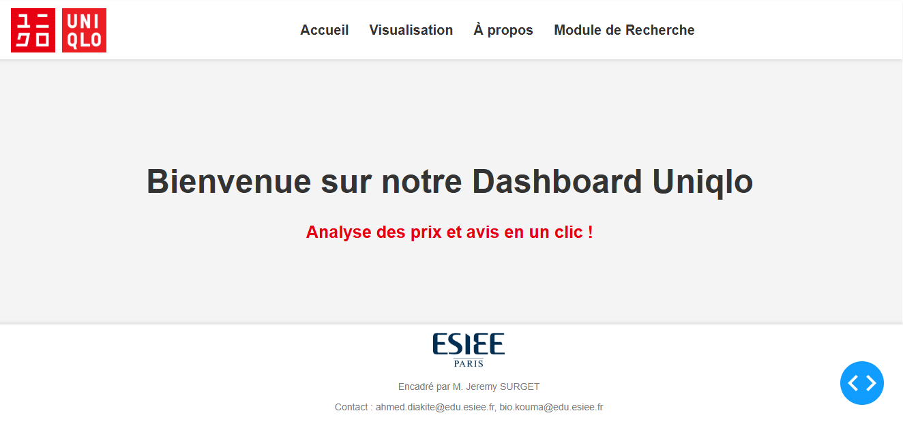


---
### **Module de recherche**

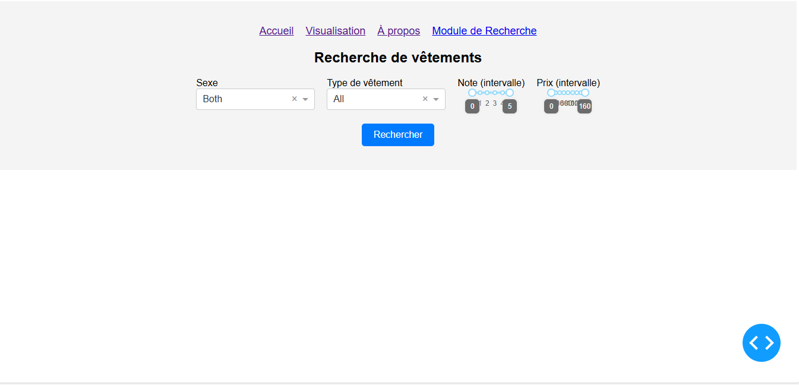
---
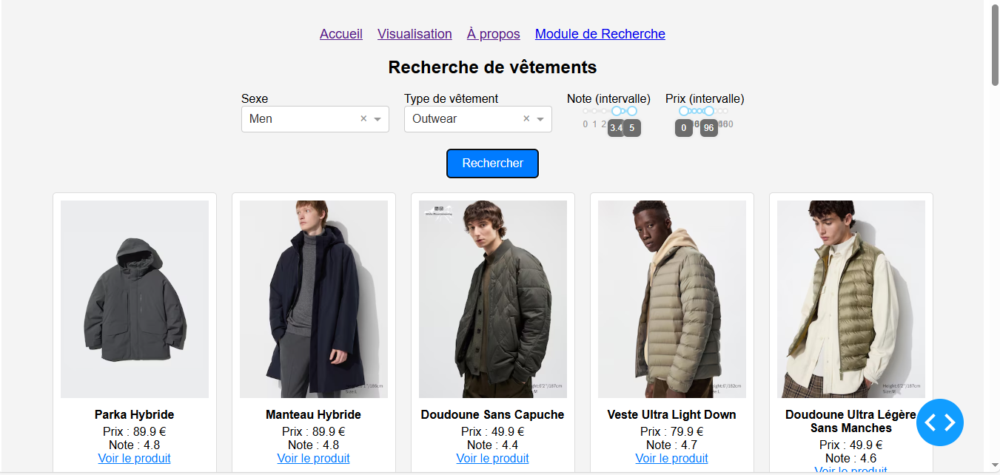
---

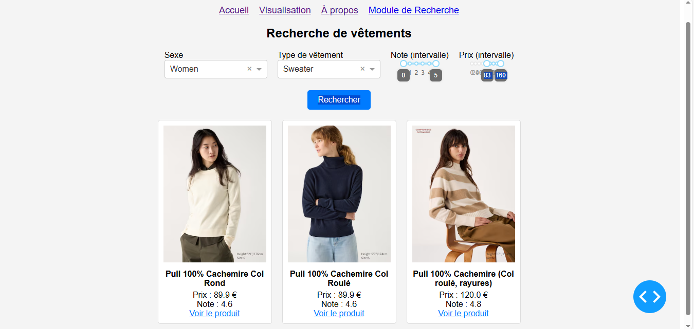
---

#### **Analyse**

On va analyser le module de recherche qui est l'élément le plus interessant du projet.

Ce module, géré par Elasticsearch, permet de requêter la base de données et d'afficher les résultats en fonction des filtres sélectionnés par l'utilisateur. Il offre une interface dynamique et interactive qui facilite la recherche de vêtements selon plusieurs critères.


**Filtres avancés**

-  Sexe : Possibilité de filtrer par genre (Men, Women, both).
Type de vêtement : Permet de choisir une catégorie spécifique (Outwear, Sweater, bottom).
-  Note (intervalle) : Sélection d’une plage de notes pour afficher uniquement les articles ayant une évaluation spécifique.
-  Prix (intervalle) : Filtrage des produits en fonction d’une fourchette de prix.
Affichage dynamique des résultats

Une liste de vêtements s’affiche sous forme de cartes contenant :<br>
-Une image du produit. <br>
-Le nom du vêtement.<br>
-Son prix en euros.<br>
-Sa note moyenne basée sur les avis des clients.<br>
Design sobre et clair facilitant la lecture et l’utilisation des filtres.

Un bouton "Rechercher" déclenche la mise à jour des résultats en fonction des critères sélectionnés.
Système de navigation avec des flèches latérales permettant de parcourir les résultats sous forme de carrousel.

---


#### **Distribution des échantillons**

Pour explorer les données, vous devez cliquer sur l'onglet **"Visualisation"**, accessible en haut de la page.

La distribution des données collectées est représentée par deux visualisations principales : 
1. **Histogramme** :  Donne une vue globale des quantités et des différences éventuelles entre les catégories et les sexes. Par exemple, les femmes ont presque deux fois plus de sweaters que les hommes.

2. **Sunburst** : Offre une vue hiérarchique et interactive des catégories d'articles en fonction du sexe.

##### **Histogramme**
Voici l'histogramme que nous avons généré dans notre tableau de bord. Il représente le nombre d'articles par catégorie (sweater, outwear, bottom) et leur répartition entre hommes et femmes :

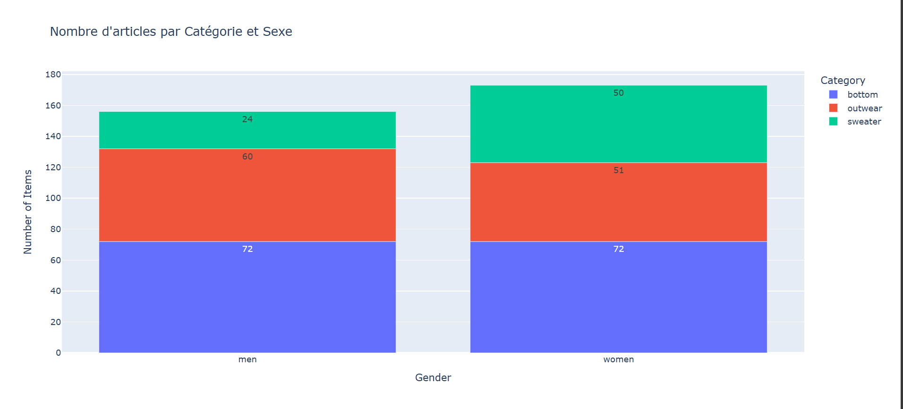

  - On remarque une répartition équilibrée pour les **"bottoms"** (identique pour hommes et femmes), mais des différences significatives pour les autres catégories. Les femmes ont plus de **sweaters** (50 vs 24) et moins **d’outwear** (51 vs 60).

##### **Sunburst**

Quant au graphique Sunburst, comme on l'a dit, il fournit une représentation visuelle des relations hiérarchiques. Dans notre cas, il montre comment les catégories d'articles (sweater, outwear, bottom) se répartissent entre les sexes (hommes et femmes) :

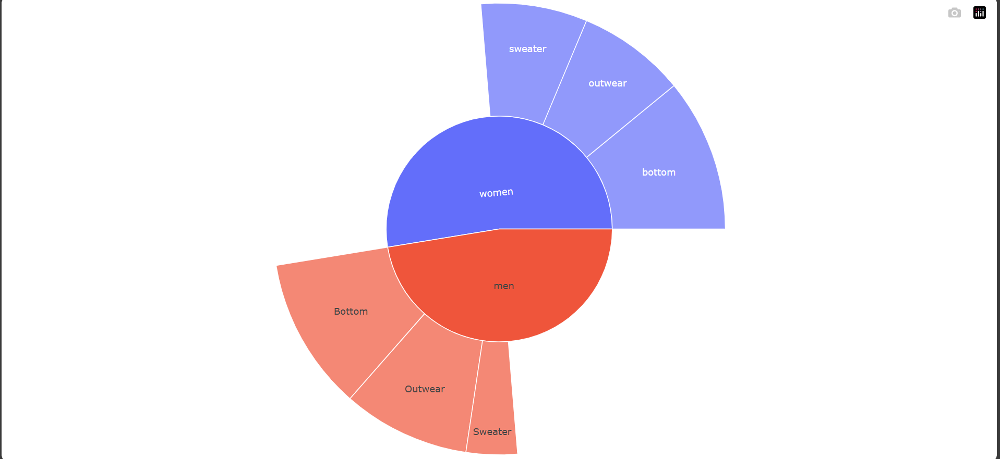

- **Zoom sur la catégorie femmes** :
  - En cliquant sur "women", nous voyons les détails suivants :

  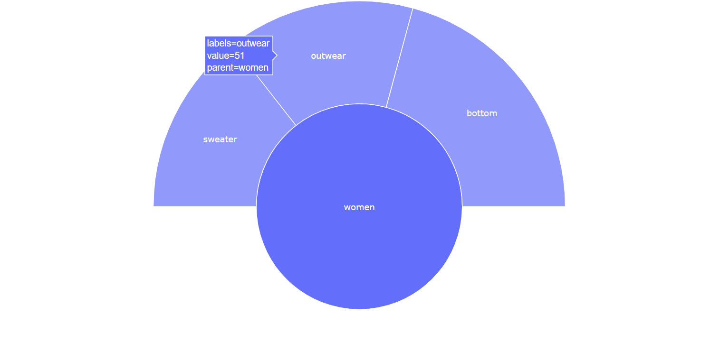
    - **Bottoms** : 72 articles.
    - **Outwear** : 51 articles.
    - **Sweaters** : 50 articles.  
  - Ces chiffres correspondent exactement à ceux observés dans l'histogramme, confirmant la cohérence des données entre les deux visualisations.

- **Points clés** :
  
  - Il est particulièrement utile pour explorer les relations entre les sexes et les catégories de produits dans notre dataset.


Grâce à ces visualisations, nous avons pu identifier des différences significatives dans la distribution des articles entre les sexes et les catégories, ce qui ouvre la voie à des analyses plus approfondies, comme l'exploration des prix ou des notes attribuées aux articles.


### **Statistiques**

###    **Analyse des Prix des Articles**

Dans notre dataset, nous avons identifié deux variables numériques particulièrement intéressantes à analyser statistiquement : les **notes** et les **prix** des articles.

Pour débuter cette exploration, nous avons choisi de nous concentrer sur l'analyse des **prix** des articles, car ces derniers offrent des informations cruciales pour comprendre la segmentation par catégorie et par sexe.

---

#### **Visualisation : Graphiques en Violon**

Pour représenter la distribution des prix, nous avons utilisé des **graphes en violon**, qui permettent de visualiser la répartition des prix de manière détaillée, tout en combinant des éléments descriptifs comme les médianes et les intervalles interquartiles.

 **Courbes** :

  Les graphiques ci dessous permettent de façon synoptique d’analyser **l’homogénéité ou la variabilité des prix** au sein de chaque catégorie et par sexe. 

  - Une fonctionnalité de **filtrage dynamique** est disponible dans notre tableau de bord, permettant de sélectionner et d’afficher uniquement la courbe qui vous semble pertinente à analyser.

  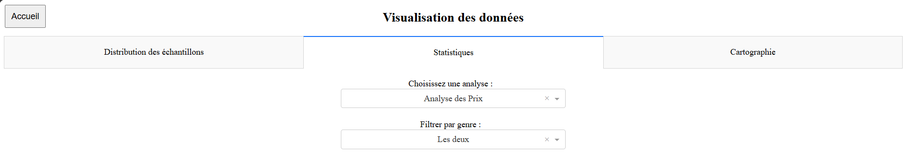


   - Pour la prémière section, trois courbes distinctes sont affichées sur notre page, représentant :
     - **Tous les articles combinés (hommes et femmes)**.
     - **Les articles pour hommes uniquement**.
     - **Les articles pour femmes uniquement**.
   
---

#### **Interprétation des Graphiques**

1. **Graphique combiné (hommes et femmes)** :
   - Ce graphique présente une vue d'ensemble des prix pour les trois catégories principales : **bottoms**, **outwear**, et **sweaters**.
   - **Observations clés** :
     - Les prix des **bottoms** sont concentrés entre 20 et 50 unités monétaires, avec quelques valeurs aberrantes dépassant 100.
     - Les **outwear** ont une répartition plus large, allant de 50 à 150, suggérant une variabilité importante selon les modèles.
     - Les **sweaters** ont des prix généralement plus bas, autour de 30 à 50, avec moins de dispersion.

   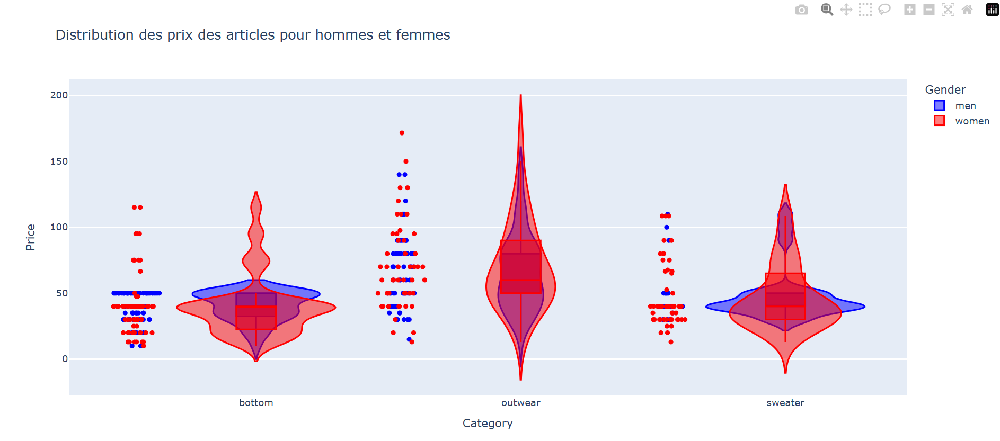

2. **Graphique pour hommes** :
   - Le graphique montre que les articles pour hommes ont des prix globalement concentrés, avec :
     - Une dispersion modérée pour les **outwear**, s’étendant jusqu'à 150.
     - Une distribution plus homogène pour les **sweaters** et les **bottoms**, avec des médianes proches de 30 à 50.


3. **Graphique pour femmes** :
   - Les articles pour femmes affichent une dispersion plus marquée des prix, particulièrement dans les catégories **outwear** et **bottoms**.
   - **Points remarquables** :
     - Les **sweaters** pour femmes ont une répartition très concentrée autour de 30 à 50, indiquant une offre homogène en termes de prix.
     - Les **outwear** pour femmes présentent des prix plus variables, avec des valeurs qui atteignent 150 ou plus.

   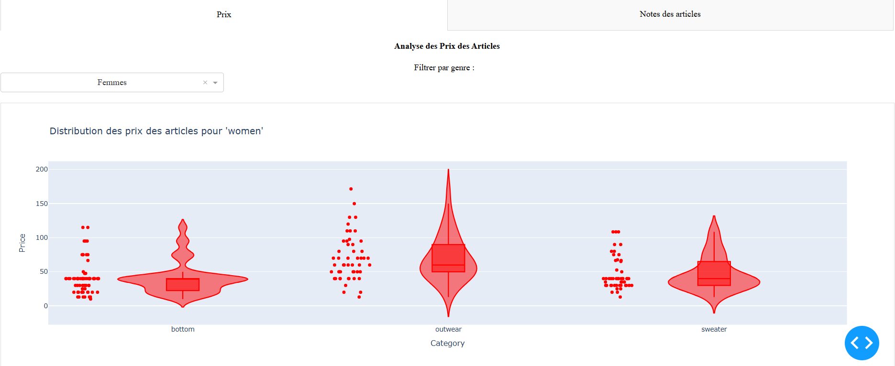

---

 Ils facilitent l’identification des écarts potentiels entre les articles destinés aux hommes et ceux destinés aux femmes.

### **Analyse des Notes des Articles**

Les **notes** attribuées aux articles constituent une autre variable clé de notre analyse, offrant une perspective sur la satisfaction des utilisateurs selon les catégories et les sexes.

---

#### ** Relation entre Prix et Notes**
Pour explorer la relation entre les **notes des articles** et leurs **prix**, nous avons utilisé un graphique de dispersion. Ce dernier nous permet d'analyser les corrélations éventuelles et de comprendre les variations des évaluations par rapport aux prix.


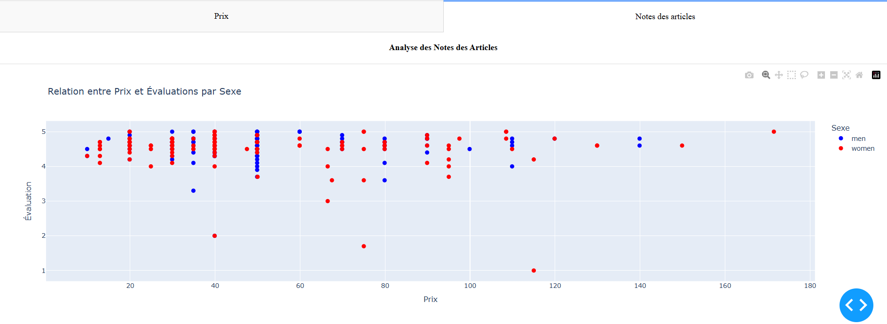

---

#### **Interprétation des Résultats**

1. **Corrélation entre prix et notes :**
   - La majorité des articles ont des évaluations comprises entre **4 et 5 étoiles**, quelle que soit la catégorie ou le sexe.
   - Les articles à bas prix (inférieurs à 50 unités) semblent recevoir des notes similaires à ceux avec des prix plus élevés, suggérant que la qualité perçue n'est pas nécessairement liée au prix.

2. **Différences entre sexes :**
   - Les articles pour **hommes** (points bleus) et pour **femmes** (points rouges) affichent des répartitions similaires en termes de notes.
   - Cependant, quelques articles pour femmes montrent une note plus faible (en dessous de **3 étoiles**), ce qui mérite une analyse plus approfondie pour identifier les causes potentielles.

3. **Outliers :**
   - Quelques articles à prix élevés (supérieurs à 100 unités) affichent des notes légèrement inférieures (3 à 4 étoiles), ce qui pourrait indiquer des attentes non satisfaites pour ces produits haut de gamme.

### **Visualisation des Nuages de Mots "WORDCLOUD"**

Afin de mettre en vitrine les articles les plus appréciés des utilisateurs, nous avons décidé de créer des **nuages de mots**, une méthode visuelle et intuitive pour analyser les termes les plus récurrents dans les descriptions des produits. Cette approche permet non seulement de mettre en lumière les tendances et préférences des consommateurs, mais également de fournir une vue d’ensemble rapide des articles les plus populaires selon le sexe. 

---
  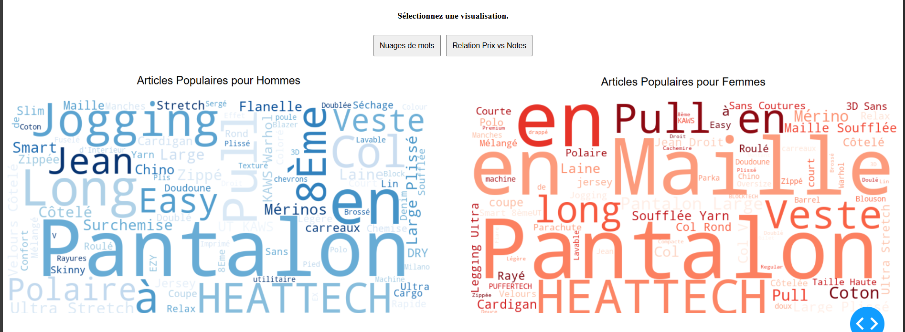
---

#### **Analyses**

1. **Pour les Hommes :**
   - Les mots clés dominants comme **"Jogging"**, **"Jean"**, et **"Veste"** reflètent une préférence pour des vêtements fonctionnels et confortables. Aussi, on voit que les termes comme **"Stretch"** ou **"Cargo"** soulignent un focus sur la praticité et la flexibilité.

2. **Pour les Femmes :**
   - Les articles les plus appréciés incluent des éléments élégants comme **"Pull"**, **"Pantalon"**, et **"Maille"**, mettant en avant des vêtements adaptés aux styles variés. Les détails comme **"Soufflée"** et **"Coutures"** mettent en évidence une attention particulière portée à l’esthétique et au raffinement.


### **Onglet Cartographie**
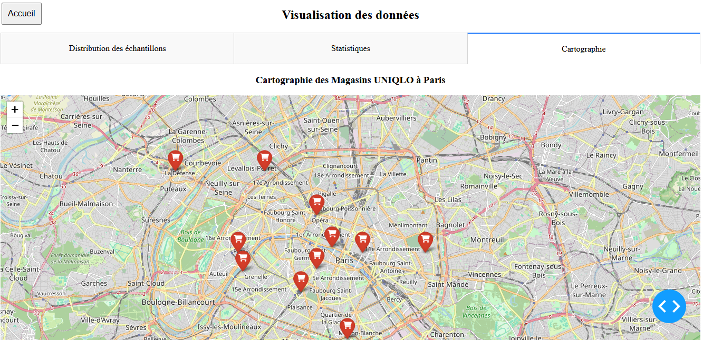

Une visualisation des différents magasins Uniqlo en Ile-de-France.


### **Conclusion**

Cette analyse montre que, globalement, les **notes restent élevées et homogènes**, quel que soit le prix ou la catégorie. Cela reflète une **satisfaction générale des utilisateurs** pour les articles proposés. Toutefois, les **outliers identifiés** pourraient indiquer des points d'amélioration pour certains produits spécifiques.

Ces observations offrent une base solide pour explorer plus en détail les produits qui obtiennent des évaluations inférieures à la moyenne, afin de proposer des recommandations stratégiques pour améliorer la satisfaction client.

